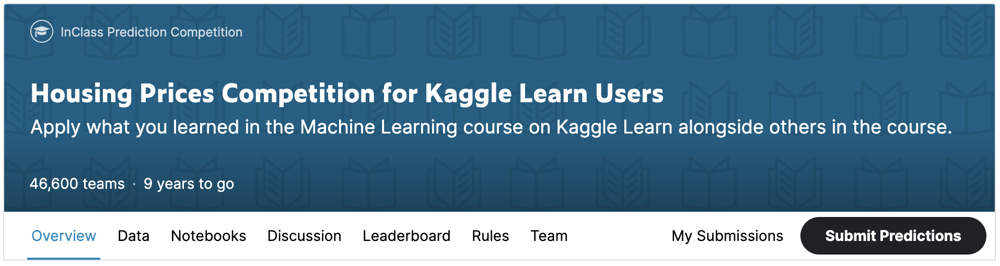

Machine learning competitions are a great way to improve your data science skills and measure your progress.

In the next exercise, you will create and submit predictions for the House Prices Competition for Kaggle Learn 
Users.

